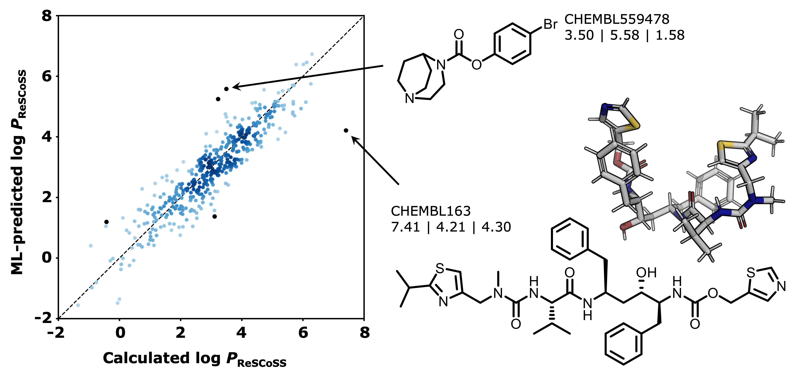

# rescoss_logp_ml: Machine intelligence models for fast, quantum mechanics-based approximation of drug lipophilicity  



[](https://github.com/cisert/rescoss_logp_ml/actions/workflows/build.yml)
[](https://codecov.io/gh/cisert/rescoss_logp_ml)
[](https://opensource.org/licenses/MIT)


Machine-learning models to predict ReSCoSS-calculated [1] log *P* values for drug-like molecules. 

Details are described in our [paper](https://pubs.acs.org/doi/10.1021/acsomega.2c05607). Please cite if you use this work. 

## Setup and testing

To setup and test everything: 
```bash
git clone https://github.com/cisert/rescoss_logp_ml.git
cd rescoss_logp_ml
export PYTHONPATH="$(pwd):$PYTHONPATH"
make
```
 
## Making predictions

To use pre-trained models to make predictions:

```python
from rescoss_logp_ml.predict_with_trained_model import predict_with_trained_model
from rescoss_logp_ml.utils import ROOT_PATH, MODEL_FILENAMES
import os


smiles_list = [
    "O=C(C)Oc1ccccc1C(=O)O",  # Aspirin
    "O=C(O[C@H]1CCOC1)N[C@@H](Cc2ccccc2)[C@H](O)CN(CC(C)C)S(=O)(=O)c3ccc(N)cc3",  # Amprenavir
    "Cc1cccc(c1NC(=O)c2cnc(s2)Nc3cc(nc(n3)C)N4CCN(CC4)CCO)Cl",  # Dasatinib
]

model_name = "chemprop" # alternatives: "rf", "lasso", "xgb"
split_type = "scaffold" # alternatives: "random"
target = "logp_rescoss" # alternatives: "logp_exp"
model_savepath = os.path.join(
        ROOT_PATH, 
        "saved_models", 
        "az_set", 
        split_type, 
        target, 
        MODEL_FILENAMES[model_name]
    )

preds = predict_with_trained_model(
    smiles_list, 
    model_name=model_name, 
    target=target, 
    model_savepath=model_savepath
)
print(preds)
```

See the `Makefile` for training/learning curve generation to replicate our results.


## References
[1] Udvarhelyi, A., Rodde, S. & Wilcken, R. ReSCoSS: a flexible quantum chemistry workflow identifying relevant solution conformers of drug-like molecules. *J. Comput. Aided. Mol. Des.* **35**, 399–415 (2021).
